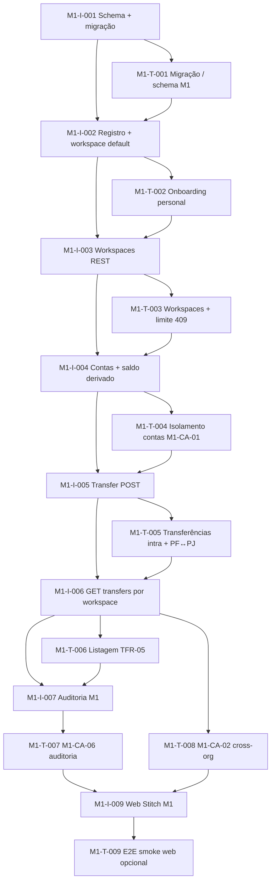

# Tasks — M1 (workspaces + contas + transferências)

**Estado:** **M1 encerrado (2026-04-15)** — Implement + checklist de fecho concluídos; próximo marco de produto: **M2** (ver `ROADMAP.md`).

**Rastreio:** [`spec.md`](./spec.md) · [`plan.md`](./plan.md) · ADR [0007](../../../docs/adr/0007-workspace-ledger-domain.md), [0008](../../../docs/adr/0008-api-workspace-scoping.md).

## Princípio TDAD

Para cada par abaixo, **escrever e ver o teste falhar (vermelho)** antes de concluir a implementação correspondente, exceto **M1-I-001** (somente schema), onde o teste é smoke de migração/schema.

## Ordem sugerida (dependências)

---

## M1-T-001 — Smoke de migração / schema M1 + backfill

| Campo | Conteúdo |
|--------|-----------|
| **Rastreio** | M1-RNF-03, Fix 7 da auditoria 2026-04-15 |
| **O quê** | (1) Garantir que a migração aplica modelos `Workspace`, `Account`, `Transfer`, enums e índices descritos no ADR-0007 (presença de tabelas/colunas ou `prisma migrate` idempotente em DB de teste). (2) **Backfill retro:** criar uma organização **antes** de aplicar a migração M1 (via SQL direto ou fixture pré-M1) e verificar que, após `prisma migrate deploy`, existe exatamente um `Workspace` ativo com `kind='personal'` para essa org. |
| **Onde** | `apps/api/src/__tests__/migration.test.ts` (estender) ou novo ficheiro dedicado ao schema M1. |
| **Feito quando** | Teste passa contra DB de teste após `M1-I-001`; falha antes da migração; `COUNT(workspaces) >= COUNT(organizations)` invariante mantido. |

## M1-I-001 — Prisma: domínio ledger M1 + data migration retro

| Campo | Conteúdo |
|--------|-----------|
| **Rastreio** | ADR-0007, M1-RF-WSP-05, Fix 7 da auditoria 2026-04-15 |
| **O quê** | (1) Adicionar enums e modelos `Workspace` (`kind` personal/business, `archivedAt`), `Account`, `Transfer`; FKs e `organizationId` redundante em `Transfer`; índices do plano; `onDelete` coerente com histórico. (2) **Data migration retro:** no mesmo arquivo de migração SQL, após criar `workspaces`, executar `INSERT INTO workspaces (id, organization_id, kind, name, created_at, updated_at) SELECT gen_random_uuid(), o.id, 'personal', 'Pessoal', now(), now() FROM organizations o LEFT JOIN workspaces w ON w.organization_id = o.id WHERE w.id IS NULL;` — garante que toda `Organization` M0 legada fica com exatamente um workspace `personal` ativo. |
| **Onde** | `prisma/schema.prisma`, `prisma/migrations/…/migration.sql` (SQL da data migration inline no mesmo arquivo) |
| **Feito quando** | `pnpm exec prisma migrate deploy` aplica schema + backfill idempotentemente; cliente gerado sem erros; `SELECT count(*) FROM organizations WHERE id NOT IN (SELECT organization_id FROM workspaces)` retorna `0` após migração. |

---

## M1-T-002 — Workspace `personal` no registo

| Campo | Conteúdo |
|--------|-----------|
| **Rastreio** | Decisão Plan #4, ADR-0007 §6 |
| **O quê** | Após `POST /v1/auth/register`, a organização criada tem exatamente um workspace ativo `kind === personal` (nome default acordado, ex. "Pessoal"). |
| **Onde** | `apps/api/src/__tests__/auth-register.test.ts` ou novo `workspaces-onboarding.test.ts`. |
| **Feito quando** | Falha antes de `M1-I-002`; passa após transação de registo atualizada. |

## M1-I-002 — Registo: criar workspace default na transação

| Campo | Conteúdo |
|--------|-----------|
| **Rastreio** | ADR-0007 §6 |
| **O quê** | Dentro da mesma `prisma.$transaction` de `registerUserAndOrg`, criar `Workspace` default `personal`; atualizar `prisma/seed.ts` se orgs seedadas precisarem de retrocompat. |
| **Onde** | `apps/api/src/services/registration.ts`, `prisma/seed.ts` |
| **Feito quando** | `M1-T-002` verde; sem regressão nos testes de auth existentes. |

---

## M1-T-003 — API workspaces: CRUD, 404, 409

| Campo | Conteúdo |
|--------|-----------|
| **Rastreio** | M1-RF-WSP-01…04, M1-CA-03, ADR-0008 §2 §6 |
| **O quê** | Testes Vitest: `GET/POST/PATCH /v1/workspaces` com `X-Organization-Id`; `POST` com N workspaces ativos no limite do plano → **409** `workspace_limit_exceeded`; `workspaceId` de outra org → **404** `workspace_not_found`; contagem só com `archivedAt IS NULL`. |
| **Onde** | `apps/api/src/__tests__/workspaces.test.ts` (novo) |
| **Feito quando** | Vermelho antes das rotas; verde após `M1-I-003`. |

## M1-I-003 — Rotas e serviço de workspaces

| Campo | Conteúdo |
|--------|-----------|
| **Rastreio** | M1-RF-WSP-01…04, ADR-0008 §2 |
| **O quê** | Implementar list/create/patch (rename + soft archive); integrar `PlanEntitlement` / serviço existente para `maxWorkspaces`; respostas JSON estáveis (409/404). |
| **Onde** | `apps/api/src/routes/workspaces.ts` (novo), `apps/api/src/services/workspaces.ts` (novo), `apps/api/src/app.ts` |
| **Feito quando** | `M1-T-003` verde; logs incluem `workspaceId` quando aplicável (plan). |

---

## M1-T-004 — Contas isoladas por workspace (M1-CA-01)

| Campo | Conteúdo |
|--------|-----------|
| **Rastreio** | M1-CA-01, M1-RF-ACC-02, M1-RF-WSP-05 |
| **O quê** | Dada org com W1 e W2, contas criadas em W1 não aparecem em `GET /v1/workspaces/:w2/accounts`; workspace arquivado → **recusa** a criar nova conta (ADR-0007). |
| **Onde** | `apps/api/src/__tests__/workspace-accounts.test.ts` (novo) |
| **Feito quando** | Falha antes de `M1-I-004`; verde após rotas de contas. |

## M1-I-004 — Contas aninhadas + saldo derivado

| Campo | Conteúdo |
|--------|-----------|
| **Rastreio** | M1-RF-ACC-01…03, ADR-0008 §3 |
| **O quê** | `GET/POST/PATCH /v1/workspaces/:workspaceId/accounts`; helper **`loadWorkspaceInOrg`** (404 `workspace_not_found`); `currentBalance` derivado; bloqueios de arquivo conforme ADR-0007. |
| **Onde** | `apps/api/src/plugins/` ou `lib/`, `routes/accounts.ts`, `services/accounts.ts`, registo em `app.ts` |
| **Feito quando** | `M1-T-004` verde; payloads alinhados ao estilo M0. |

---

## M1-T-005 — Transferências: intra, PF↔PJ, 422

| Campo | Conteúdo |
|--------|-----------|
| **Rastreio** | M1-CA-04, M1-CA-05, M1-RF-TFR-01…04 |
| **O quê** | `POST /v1/transfers`: intra-workspace atualiza saldos consistentes; `personal`↔`business` inter-workspace permitido; `personal`↔`personal` (ou PJ↔PJ) → **422** `transfer_workspace_kind_not_allowed`; moedas diferentes / conta arquivada → 422 adequado; mesma org. |
| **Onde** | `apps/api/src/__tests__/workspace-transfers.test.ts` (novo) |
| **Feito quando** | Vermelho antes do serviço; verde após `M1-I-005`. |

## M1-I-005 — POST /v1/transfers com transação serializável

| Campo | Conteúdo |
|--------|-----------|
| **Rastreio** | M1-RF-TFR-01…04, ADR-0007 §4, ADR-0008 §4 |
| **O quê** | Validar contas carregadas, igualdade de `organizationId`, regras PF↔PJ; `prisma.$transaction` com `isolationLevel: 'Serializable'` (ou alternativa documentada se driver falhar); nunca confiar em `organizationId` do body. |
| **Onde** | `apps/api/src/routes/transfers.ts`, `apps/api/src/services/transfers.ts`, `app.ts` |
| **Feito quando** | `M1-T-005` verde. |

---

## M1-T-006 — Listagem de transferências por workspace (M1-RF-TFR-05)

| Campo | Conteúdo |
|--------|-----------|
| **Rastreio** | M1-RF-TFR-05, M1-CA-05 |
| **O quê** | `GET /v1/workspaces/:workspaceId/transfers` inclui transferências em que **origem ou destino** está numa conta daquele workspace. |
| **Onde** | `apps/api/src/__tests__/workspace-transfers-list.test.ts` ou extensão de `workspace-transfers.test.ts` |
| **Feito quando** | Falha antes de `M1-I-006`; verde após implementação. |

## M1-I-006 — GET transfers por workspace

| Campo | Conteúdo |
|--------|-----------|
| **Rastreio** | ADR-0008 §4 |
| **O quê** | Implementar listagem com join/filter corretos e ordenação por `bookedAt`/`createdAt` (definir no código; documentar se necessário). |
| **Onde** | `routes/transfers.ts` ou rota dedicada sob workspaces |
| **Feito quando** | `M1-T-006` verde. |

---

## M1-T-007 — Auditoria M1 (M1-CA-06)

| Campo | Conteúdo |
|--------|-----------|
| **Rastreio** | M1-RF-AUD-01, M1-CA-06 |
| **O quê** | Para cada operação: criar/editar/arquivar workspace; criar/editar/arquivar conta; criar transferência — existe linha `audit_logs` com `action` estável e `metadata` contendo `workspaceId` / `organizationId` quando aplicável. |
| **Onde** | `apps/api/src/__tests__/workspace-audit.test.ts` (novo) ou extensão de `audit.test.ts` |
| **Feito quando** | Falha até `M1-I-007` completar cobertura; verde com auditoria. |

## M1-I-007 — appendAudit e ações M1

| Campo | Conteúdo |
|--------|-----------|
| **Rastreio** | M1-RF-AUD-01 |
| **O quê** | Estender `appendAudit` / chamadas nos serviços M1 com ações e metadados rastreáveis. |
| **Onde** | `apps/api/src/services/audit.ts`, serviços/rotas M1 |
| **Feito quando** | `M1-T-007` verde. |

---

## M1-T-008 — Isolamento cross-org (M1-CA-02)

| Campo | Conteúdo |
|--------|-----------|
| **Rastreio** | M1-CA-02, M1-RNF-01 |
| **O quê** | Utilizador org B não lê workspace/conta/transferência de org A por UUID (403 ou 404 alinhado ao padrão M0 + ADR-0008). |
| **Onde** | `apps/api/src/__tests__/tenant-isolation.test.ts` (estender) ou `workspace-tenant-isolation.test.ts` |
| **Feito quando** | Cobre todas as novas rotas sensíveis; **implementação** corresponde a `loadWorkspaceInOrg`, filtros por `organizationId` e validações em `M1-I-003`…`M1-I-006` — ajustar códigos HTTP aqui se o teste o exigir. |

---

## M1-T-009 — E2E web (opcional, recomendado)

| Campo | Conteúdo |
|--------|-----------|
| **Rastreio** | Spec *Referência de UI* |
| **O quê** | Playwright: fluxo mínimo — login/registo → lista de workspaces → abrir contas de um workspace (smoke). |
| **Onde** | `apps/web/e2e/` |
| **Feito quando** | Verde em CI ou documentado como `skip` se ambiente não disponível. |

## M1-I-009 — Web: superfície M1 alinhada ao Stitch

| Campo | Conteúdo |
|--------|-----------|
| **Rastreio** | `spec.md` *Referência de UI*, `plan.md` §UI |
| **O quê** | Rotas/páginas: gerir workspaces, contas por workspace, transferências, configurações da org; cliente HTTP (`api.ts`) para novos endpoints; reutilizar tokens em `docs/design/stitch-reference/` e `DESIGN-SYSTEM.md`. |
| **Onde** | `apps/web/src/` (`App.tsx`, páginas, estilos) |
| **Feito quando** | UI coerente com referência; chamadas autenticadas com `X-Organization-Id`. |

---

## Checklist de fecho M1 (Implement)

- [x] Todos os pares TDAD acima com testes a verde (`pnpm test` na raiz).
- [x] Nenhum requisito M1-CA-01…06 sem tarefa mapeada (cobertura em `apps/api/src/__tests__/workspace-*.test.ts`, `tenant-isolation`, `workspace-audit`, `migration-m1`).
- [x] Revisão rápida contra ADR-0008 (`workspace_not_found` 404; `workspace_limit_exceeded` 409; erros de transferência 404/422 documentados).
- [x] `STATE.md` / `ROADMAP.md` atualizados no fecho M1.

---

**Gate Tasks → Implement:** concluído (2026-04-15). **M1 fechado (2026-04-15).** **Seguinte (SDD):** iniciar **M2** por **Specify** em `.specs/features/` (cartões / motor de faturas), conforme `ROADMAP.md`.
