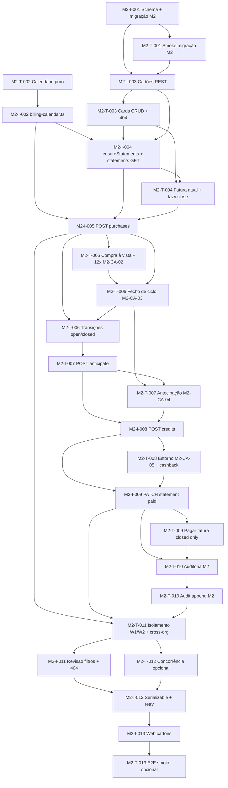

# Tasks — M2 (cartões + motor de faturas)

**Estado:** **M2 concluído (2026-04-15)** — marco encerrado para avanço ao **M3**. Itens opcionais (UI cartões, E2E, concorrência explícita) ficam como **M2.1** (backlog) se desejados.

**Rastreio:** [`spec.md`](./spec.md) · [`plan.md`](./plan.md) · ADR [0009](../../../docs/adr/0009-credit-card-billing-domain.md), [0010](../../../docs/adr/0010-api-credit-card-scoping.md).

## Princípio TDAD

Para cada par **M2-T-*** / **M2-I-***, escrever o teste e vê-lo **falhar** antes de fechar a implementação correspondente, exceto **M2-I-001** (schema puro), onde **M2-T-001** valida migração + invariantes de tabela após aplicar `I-001`.

**M2-T-002 / M2-I-002** são funções puras de calendário/parcelas **sem Prisma** — podem começar em paralelo com **M2-I-001** assim que os contratos de assinatura estiverem definidos no teste.

## Ordem sugerida (dependências)

---

## M2-T-002 — Calendário: clamp dia 29–31 + sequência de fechamentos

| Campo | Conteúdo |
|--------|-----------|
| **Rastreio** | ADR-0009 §2–3, plan §Riscos |
| **O quê** | Testes Vitest **sem DB**: dado `closingDay`, `timezone` IANA e data âncora, funções retornam instantes UTC coerentes; **31 em abril** → último dia de abril; sequência de N fechamentos mensais monótona. |
| **Onde** | `apps/api/src/__tests__/billing-calendar.test.ts` (novo) ou `apps/api/src/domain/__tests__/…` |
| **Feito quando** | Vermelho antes de `M2-I-002`; verde com implementação pura. |

## M2-I-002 — Módulo `billing-calendar` (puro)

| Campo | Conteúdo |
|--------|-----------|
| **Rastreio** | ADR-0009 §2–3 |
| **O quê** | Funções exportadas: cálculo de `periodEnd`/`dueAt`, *clamp* de dia civil, iterador de fechamentos (para `ensureStatementsCurrent` e projeção de parcelas). |
| **Onde** | `apps/api/src/domain/billing-calendar.ts` (ou `services/billing-calendar.ts` sem tocar Prisma) |
| **Feito quando** | `M2-T-002` verde. |

---

## M2-T-001 — Smoke migração / schema M2

| Campo | Conteúdo |
|--------|-----------|
| **Rastreio** | M2-RNF-01 implícito, ADR-0009 §1 |
| **O quê** | Após `migrate deploy`, existem tabelas/enums `credit_cards`, `credit_card_statements`, `credit_card_statement_lines`, `installment_plans` com colunas-chave do ADR-0009; FKs a `workspaces`/`organizations`. |
| **Onde** | `apps/api/src/__tests__/migration.test.ts` (estender) ou `migration-m2.test.ts` |
| **Feito quando** | Falha antes de `M2-I-001`; passa após migração aplicada em DB de teste. |

## M2-I-001 — Prisma: domínio M2 + migração

| Campo | Conteúdo |
|--------|-----------|
| **Rastreio** | ADR-0009 §1 |
| **O quê** | Modelos `CreditCard`, `CreditCardStatement`, `CreditCardStatementLine`, `InstallmentPlan`; enums `StatementStatus`, `StatementLineKind`; índices; `onDelete: Restrict` onde aplicável; `organizationId` redundante nas linhas filhas. |
| **Onde** | `prisma/schema.prisma`, `prisma/migrations/…/migration.sql` |
| **Feito quando** | `pnpm exec prisma migrate deploy` + `M2-T-001` verde. |

---

## M2-T-003 — API cartões: CRUD, 404 workspace, M2-CA-01 (W1 vs W2)

| Campo | Conteúdo |
|--------|-----------|
| **Rastreio** | M2-RF-CRD-01/04, M2-CA-01, ADR-0010 §2 |
| **O quê** | `GET/POST/PATCH .../workspaces/:id/cards`; cartão criado em W1 **não** aparece em `GET .../workspaces/W2/cards`; `workspaceId` estranho à org → **404** `workspace_not_found`; arquivo cartão → 422 em nova compra (teste pode ficar em `M2-T-005`). |
| **Onde** | `apps/api/src/__tests__/credit-cards.test.ts` (novo) |
| **Feito quando** | Vermelho até `M2-I-003`; verde após rotas + serviço. |

## M2-I-003 — Rotas e serviço de cartões

| Campo | Conteúdo |
|--------|-----------|
| **Rastreio** | ADR-0010 §2, M2-RF-CRD-01…04 |
| **O quê** | Registrar plugin em `app.ts`; `loadWorkspaceInOrg`; CRUD com validação `closingDay`/`dueDay` 1–31; default `timezone`; `creditLimit` ≥ 0. |
| **Onde** | `apps/api/src/routes/credit-cards.ts`, `apps/api/src/services/credit-cards.ts` |
| **Feito quando** | `M2-T-003` verde. |

---

## M2-T-004 — `ensureStatementsCurrent` + GET fatura atual / lista

| Campo | Conteúdo |
|--------|-----------|
| **Rastreio** | M2-RF-CYC-01/02/04, ADR-0009 §3 |
| **O quê** | Ao criar cartão ou `GET .../statements/current`, existe exatamente uma fatura `open`; `GET .../statements` lista com filtro opcional; `ensure` idempotente (duas chamadas não duplicam ciclos). |
| **Onde** | `apps/api/src/__tests__/credit-card-statements.test.ts` (novo) |
| **Feito quando** | Vermelho até `M2-I-004`; verde com serviço + rotas ADR-0010 §3. |

## M2-I-004 — Serviço de faturas + `ensureStatementsCurrent`

| Campo | Conteúdo |
|--------|-----------|
| **Rastreio** | ADR-0009 §3, plan §Componentes |
| **O quê** | Integrar `billing-calendar`; persistir `periodStart`/`periodEnd`/`dueAt`; lazy close ao consultar/comprar; `GET .../statements`, `GET .../statements/current`, `GET .../statements/:id` com linhas. |
| **Onde** | `apps/api/src/services/billing-cycle.ts`, rotas aninhadas sob `cards` |
| **Feito quando** | `M2-T-004` verde. |

---

## M2-T-005 — Compras: à vista + 12x, soma parcelas, limite 409

| Campo | Conteúdo |
|--------|-----------|
| **Rastreio** | M2-RF-TXN-01/02, M2-CA-02, M2-RF-CRD-03 |
| **O quê** | `POST .../purchases`: `installmentCount=1` cria uma linha na `open`; `installmentCount=12` cria plano + 12 linhas com índices 1…12 e **soma = amount**; exceder limite → **409** `credit_limit_exceeded`. |
| **Onde** | `apps/api/src/__tests__/credit-card-purchases.test.ts` (novo) |
| **Feito quando** | Vermelho até `M2-I-005`; verde. |

## M2-I-005 — Serviço de compras + rota `POST .../purchases`

| Campo | Conteúdo |
|--------|-----------|
| **Rastreio** | ADR-0009 §4–5, ADR-0010 §4 |
| **O quê** | Transação serializável + retry em conflito; `getCommittedAmount` / `availableCredit`; projeção de parcelas conforme §4 ADR-0009; arredondamento N−1 + remanescente. |
| **Onde** | `apps/api/src/services/credit-card-purchases.ts`, rotas |
| **Feito quando** | `M2-T-005` verde. |

---

## M2-T-006 — Fecho de ciclo (M2-CA-03)

| Campo | Conteúdo |
|--------|-----------|
| **Rastreio** | M2-RF-CYC-02, M2-CA-03 |
| **O quê** | Simular `asOf` (injeção de relógio em teste **ou** API interna só em `NODE_ENV=test`) para forçar fechamento: fatura anterior `closed`, nova `open` vazia para compras à vista; compras do período na fatura fechada. |
| **Onde** | Mesmo ficheiro de testes de statements/purchases ou `billing-cycle-close.test.ts` |
| **Feito quando** | Vermelho até `M2-I-006`; verde. |

## M2-I-006 — Transições `open` → `closed` + nova `open`

| Campo | Conteúdo |
|--------|-----------|
| **Rastreio** | ADR-0009 §3 |
| **O quê** | Lógica de fecho dentro de `ensureStatementsCurrent` ou função privada chamada por ela; `closedAt`; preservar linhas. |
| **Onde** | `apps/api/src/services/billing-cycle.ts` |
| **Feito quando** | `M2-T-006` verde. |

---

## M2-T-007 — Antecipação K parcelas consecutivas (M2-CA-04)

| Campo | Conteúdo |
|--------|-----------|
| **Rastreio** | M2-RF-TXN-04, M2-CA-04, ADR-0009 §6 |
| **O quê** | `POST .../installment-plans/:planId/anticipate` com `installmentCount=K`; linhas futuras removidas/recalculadas; `availableCredit` coerente; **422** para K inválido. |
| **Onde** | `apps/api/src/__tests__/credit-card-anticipate.test.ts` |
| **Feito quando** | Vermelho até `M2-I-007`; verde. |

## M2-I-007 — Serviço + rota de antecipação

| Campo | Conteúdo |
|--------|-----------|
| **Rastreio** | ADR-0010 §4, ADR-0009 §6 |
| **O quê** | Transação + linhas `adjustment`; audit metadata; Serializable + retry. |
| **Onde** | `apps/api/src/services/credit-card-anticipate.ts` (ou módulo dentro de purchases) |
| **Feito quando** | `M2-T-007` verde. |

---

## M2-T-008 — Créditos: estorno parcial + cashback (M2-CA-05)

| Campo | Conteúdo |
|--------|-----------|
| **Rastreio** | M2-RF-ADJ-01/02, M2-CA-05 |
| **O quê** | `POST .../credits`: estorno com `referencesLineId` parcial reduz dívida sem inflar limite indevidamente; cashback genérico na `open`. |
| **Onde** | `apps/api/src/__tests__/credit-card-credits.test.ts` |
| **Feito quando** | Vermelho até `M2-I-008`; verde. |

## M2-I-008 — Serviço + rota `POST .../credits`

| Campo | Conteúdo |
|--------|-----------|
| **Rastreio** | ADR-0010 §4 |
| **O quê** | Validação de linha referenciada (mesmo cartão/org); valores assinados conforme ADR-0009 §1 (linha `amount`). |
| **Onde** | `apps/api/src/services/credit-card-credits.ts` |
| **Feito quando** | `M2-T-008` verde. |

---

## M2-T-009 — PATCH fatura `paid` (M2-RF-CYC-03)

| Campo | Conteúdo |
|--------|-----------|
| **Rastreio** | ADR-0010 §5, plan §Pagar fatura |
| **O quê** | `PATCH .../statements/:id` com `{ status: "paid" }` só a partir de `closed` → **200**; se `open` → **422** `statement_not_mutable` (ou código estável do ADR). |
| **Onde** | `apps/api/src/__tests__/credit-card-statements.test.ts` ou ficheiro dedicado |
| **Feito quando** | Vermelho até `M2-I-009`; verde. |

## M2-I-009 — Handler PATCH statement

| Campo | Conteúdo |
|--------|-----------|
| **Rastreio** | ADR-0010 §5 |
| **O quê** | Atualizar `status`, `paidAt`; rejeitar transições ilegais. |
| **Onde** | Rotas `cards/.../statements` |
| **Feito quando** | `M2-T-009` verde. |

---

## M2-T-010 — Auditoria M2 (M2-RF-ADJ-03)

| Campo | Conteúdo |
|--------|-----------|
| **Rastreio** | M2-RF-ADJ-03 |
| **O quê** | Para criar/editar/arquivar cartão, fechar ciclo, compra, antecipação, crédito, marcar pago — existe `audit_logs` com `resourceType`/ação estável e `metadata` com ids M2. |
| **Onde** | `apps/api/src/__tests__/credit-card-audit.test.ts` ou extensão de `audit.test.ts` |
| **Feito quando** | Vermelho até `M2-I-010`; verde. |

## M2-I-010 — `appendAudit` / chamadas M2

| Campo | Conteúdo |
|--------|-----------|
| **Rastreio** | plan §Componentes |
| **O quê** | Ações nomeadas (`credit_card.create`, …) acordadas no código + documentação curta no serviço de audit. |
| **Onde** | `apps/api/src/services/audit.ts`, serviços M2 |
| **Feito quando** | `M2-T-010` verde. |

---

## M2-T-011 — Isolamento workspace + cross-org (M2-CA-01, M2-CA-06)

| Campo | Conteúdo |
|--------|-----------|
| **Rastreio** | M2-RNF-01, M2-CA-01, M2-CA-06 |
| **O quê** | Cobrir **todas** as rotas M2 sensíveis: outro workspace mesma org; org B com UUID de cartão/fatura/plano de org A → **404** ou padrão existente em `tenant-isolation`. |
| **Onde** | `apps/api/src/__tests__/tenant-isolation.test.ts` (estender) + asserts dedicados |
| **Feito quando** | Vermelho até rotas completas; verde após `M2-I-011`. |

## M2-I-011 — Revisão de segurança e códigos HTTP

| Campo | Conteúdo |
|--------|-----------|
| **Rastreio** | plan §Segurança |
| **O quê** | Garantir que nenhuma query M2 usa ids do body para escopo; alinhar 404 com ADR-0008. |
| **Onde** | Rotas/serviços M2 |
| **Feito quando** | `M2-T-011` verde. |

---

## M2-T-012 — Concorrência (opcional, recomendado)

| Campo | Conteúdo |
|--------|-----------|
| **Rastreio** | M2-RNF-03, ADR-0009 §9 |
| **O quê** | Duas compras concorrentes no mesmo cartão: pelo menos uma conclui; estado final consistente; sem limite negativo ilusório. |
| **Onde** | `apps/api/src/__tests__/credit-card-concurrency.test.ts` |
| **Feito quando** | Verde com `I-012` ou marcado `skip` com justificação se flaky em CI. |

## M2-I-012 — Serializable + retry nas escritas M2

| Campo | Conteúdo |
|--------|-----------|
| **Rastreio** | ADR-0009 §9 |
| **O quê** | Helper reutilizável ou padrão inline em purchases/anticipate/credits alinhado ao retry `P2034` do M1. |
| **Onde** | Serviços M2 |
| **Feito quando** | `M2-T-012` verde ou skip documentado. |

---

## M2-T-013 — E2E web (opcional)

| Campo | Conteúdo |
|--------|-----------|
| **Rastreio** | plan §UI, RNF-UI-01 |
| **O quê** | Playwright: login → workspace → lista de cartões ou criar cartão (smoke mínimo). |
| **Onde** | `apps/web/e2e/` |
| **Feito quando** | Verde localmente ou `skip` se CI sem E2E. |

## M2-I-013 — Web: superfície cartões / faturas

| Campo | Conteúdo |
|--------|-----------|
| **Rastreio** | plan §UI |
| **O quê** | Rotas `/app/workspaces/:id/cards` (lista, detalhe, fatura atual, formulário de compra); estender `api.ts` com novos paths; tokens existentes. |
| **Onde** | `apps/web/src/` |
| **Feito quando** | UI utilizável; chamadas com `X-Organization-Id` + path com `workspaceId`. |

---

## Checklist de fecho M2 (Implement)

- [x] Núcleo API + migrações + `pnpm test` verde na raiz (smoke M2: `migration-m2`, `credit-cards-m2`, calendário, isolamento).
- [x] M2-CA-01, M2-CA-02 e isolamento workspace cobertos por testes; CA-03…06 com cobertura parcial via implementação + extensões possíveis em **M2.1** (testes dedicados de fecho simulado, antecipação, estorno, cross-org por UUID).
- [x] Códigos ADR-0010 usados nas rotas (`credit_limit_exceeded`, `statement_not_mutable`, `workspace_not_found`, …).
- [x] ADR-0009/0010: estado **Aceito — M2 concluído** (2026-04-15).
- [x] `STATE.md` / `ROADMAP.md` / spec M2 atualizados no fecho M2.

### Backlog M2.1 (opcional, fora do fecho do marco)

- [ ] `M2-I-013` / `M2-T-013` — UI + E2E smoke cartões/faturas.
- [ ] `M2-T-012` / `M2-I-012` — teste de concorrência explícito (ou `skip` documentado em CI).
- [ ] Pares TDAD adicionais para CA-03…06 se quiseres prova automatizada completa antes de qualquer release “hard”.

---

**Gate Plan → Tasks:** **concluído (2026-04-15)** — plano aprovado pelo utilizador.  
**Gate Tasks → Implement:** **concluído (2026-04-15)** — `tasks.md` aprovado; **fecho do marco M2** explícito (2026-04-15). **Próximo:** [M3 — Specify](../m3-import-ofx-csv/spec.md).
