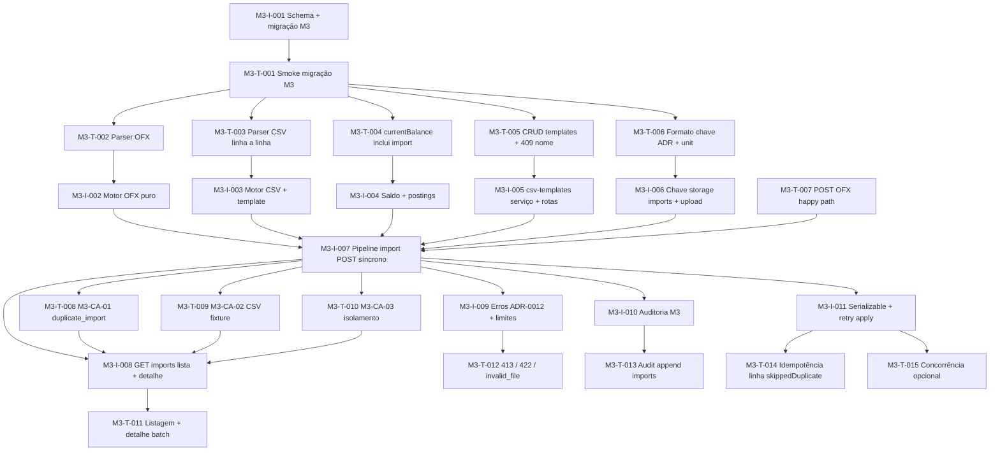

# Tasks — M3 (importação OFX / CSV)

**Estado:** **M3 API concluído (2026-04-15)** — checklist de fecho abaixo fechado para o âmbito API; **M3.1** (UI/E2E) em backlog.

**Rastreio:** [`spec.md`](./spec.md) · [`plan.md`](./plan.md) · ADR [0011](../../../docs/adr/0011-import-ofx-csv-domain.md), [0012](../../../docs/adr/0012-api-import-ofx-csv-scoping.md) · C4 [`c4-m3-import-ofx-csv.md`](../../../docs/architecture/c4-m3-import-ofx-csv.md).

## Princípio TDAD

Para cada par **M3-T-*** / **M3-I-***, escrever o teste e vê-lo **falhar** antes de fechar a implementação correspondente, exceto **M3-I-001** (schema + migração), onde **M3-T-001** valida tabelas/enums/índices após `migrate deploy` em DB de teste.

**Motores OFX/CSV (M3-I-002 / M3-I-003):** funções puras **sem** Fastify/Prisma nos ficheiros sob `apps/api/src/import/ofx/*` e `apps/api/src/import/csv/*`; testes associados em `apps/api/src/import/**/__tests__/*.ts` ou `apps/api/src/__tests__/import-*.test.ts`.

## Ordem sugerida (dependências)

---

## M3-T-001 — Smoke migração / schema M3

| Campo | Conteúdo |
|--------|-----------|
| **Rastreio** | ADR-0011 §1, M3-RNF-01 |
| **O quê** | Após `migrate deploy` em DB de teste: existem modelos/enums `CsvImportTemplate`, `ImportBatch`, `AccountImportPosting`, `ImportBatchStatus` (ou nomes Prisma equivalentes), FKs a `Organization`/`Workspace`/`Account`/`User`, índice único parcial lote (`contentSha256` + `workspaceId` + `targetAccountId` para `completed`/`partial`) e único parcial `(accountId, externalStableId)` onde aplicável — conforme migração. |
| **Onde** | `apps/api/src/__tests__/migration.test.ts` (estender) ou `migration-m3.test.ts` |
| **Feito quando** | Falha antes de `M3-I-001`; passa após migração aplicada. |

## M3-I-001 — Prisma: domínio M3 + migração

| Campo | Conteúdo |
|--------|-----------|
| **Rastreio** | ADR-0011 §1, plan §Modelo de dados |
| **O quê** | Adicionar enums e tabelas com colunas do ADR; relações `Account` ← `ImportBatch` / `AccountImportPosting`; `CsvImportTemplate` com `workspaceId` nullable; constraints Postgres (partial unique) documentadas no SQL; `onDelete` coerente (Restrict em contas/workspace). |
| **Onde** | `prisma/schema.prisma`, `prisma/migrations/…/migration.sql` |
| **Feito quando** | `pnpm exec prisma migrate deploy` + `prisma generate` sem erros; `M3-T-001` verde. |

---

## M3-T-002 — Parser OFX: extrair transações de fixture

| Campo | Conteúdo |
|--------|-----------|
| **Rastreio** | plan §Motor OFX, M3-RNF-02 |
| **O quê** | Vitest **sem DB**: dado buffer/string OFX (SGML ou XML mínimo) com `BANKTRANLIST` / `STMTTRN`, extrair lista `{ trnamt, dtposted, fitid?, memo?, name? }` normalizada; tolerância a variações de casing/tags. |
| **Onde** | `apps/api/src/import/ofx/__tests__/parse-ofx.test.ts` + fixture em `apps/api/src/__tests__/fixtures/` (ex. `sample.ofx` anonimizado) |
| **Feito quando** | Vermelho antes de `M3-I-002`; verde com parser. |

## M3-I-002 — Módulo motor OFX (puro)

| Campo | Conteúdo |
|--------|-----------|
| **Rastreio** | ADR-0011 §3 (FITID), plan decisão #5/#8 |
| **O quê** | Função(ões) exportadas: parse de bytes UTF-8; mapear `TRNAMT`, `DTPOSTED`, `FITID`, `MEMO`/`NAME`; datas sem timezone → interpretar em `America/Sao_Paulo`, saída `bookedAt` em UTC (`Date` ou ISO string); validação mínima assinatura (`OFXHEADER` / `<OFX>`) → erro tipado para camada API (`invalid_file`). |
| **Onde** | `apps/api/src/import/ofx/parse-ofx.ts` (e ficheiros auxiliares no mesmo diretório) |
| **Feito quando** | `M3-T-002` verde; zero imports de `fastify`/`@prisma/client`. |

---

## M3-T-003 — CSV: aplicar template a linhas de fixture

| Campo | Conteúdo |
|--------|-----------|
| **Rastreio** | M3-RF-MAP-01, ADR-0011 §3 fingerprint CSV |
| **O quê** | Testes sem DB: `columnMap` + `dateFormat` + `decimalSeparator` + timezone opcional → linhas parseadas com `amount` assinado, `bookedAt` UTC, `description`/`memo`, `externalStableId` (fingerprint quando sem id externo). Casos erro por linha acumuláveis. |
| **Onde** | `apps/api/src/import/csv/__tests__/apply-csv-template.test.ts` |
| **Feito quando** | Vermelho antes de `M3-I-003`; verde com implementação. |

## M3-I-003 — Módulo motor CSV (puro)

| Campo | Conteúdo |
|--------|-----------|
| **Rastreio** | ADR-0011 §3, plan decisão #4/#8 |
| **O quê** | Parser streaming ou por linhas com limite **10 000** linhas de dados (cabeçalho excluído); suportar `amount` único ou par `debit`/`credit`; algoritmo de fingerprint estável documentado num comentário curto + teste dourado. |
| **Onde** | `apps/api/src/import/csv/apply-csv-template.ts` |
| **Feito quando** | `M3-T-003` verde. |

---

## M3-T-004 — Saldo de conta inclui `AccountImportPosting`

| Campo | Conteúdo |
|--------|-----------|
| **Rastreio** | ADR-0011 §2, M3-RF-LED-01 |
| **O quê** | Dado conta com `initialBalance`, `Transfer`s existentes e postings de importação conhecidos, o valor exposto como `currentBalance` em listagem/detalhe de conta coincide com a fórmula ADR-0011 (soma algébrica dos `amount` dos postings). |
| **Onde** | `apps/api/src/__tests__/accounts-import-balance.test.ts` (novo) ou extensão de testes de contas |
| **Feito quando** | Falha antes de `M3-I-004`; passa após ajuste de `computeBalancesForAccounts` (ou helper dedicado agregado). |

## M3-I-004 — Estender cálculo de saldo (`accounts.ts`)

| Campo | Conteúdo |
|--------|-----------|
| **Rastreio** | ADR-0011 §2 |
| **O quê** | Incluir `Σ(AccountImportPosting.amount)` por `accountId` na mesma leitura em batch que hoje agrega `Transfer`s; manter tipos `AccountWithBalance`. |
| **Onde** | `apps/api/src/services/accounts.ts` |
| **Feito quando** | `M3-T-004` verde; sem regressão nos testes M1 de contas. |

---

## M3-T-005 — API templates CSV: CRUD, scope, 409

| Campo | Conteúdo |
|--------|-----------|
| **Rastreio** | ADR-0012 §3, M3-RF-MAP-01 |
| **O quê** | `GET/POST/PATCH/DELETE` …`/csv-templates`: criar template scope workspace vs org (`workspaceId` null); listagem `scope=`; `409 template_name_conflict`; `404 template_not_found`; validação de `columnMap` mínimo (`date` + (`amount` ou `debit`+`credit`)). |
| **Onde** | `apps/api/src/__tests__/csv-templates.test.ts` |
| **Feito quando** | Vermelho antes de `M3-I-005`; verde com rotas registadas em `app.ts`. |

## M3-I-005 — Serviço + rotas `csv-templates`

| Campo | Conteúdo |
|--------|-----------|
| **Rastreio** | ADR-0012 §1, §3, plan §Segurança |
| **O quê** | Handlers com `requireAuth`, `requireOrgContext`, `loadWorkspaceInOrg`; body JSON validado; `POST` com `scope: organization` apenas se política de papel permitir (**owner** como default alinhado ao ADR). |
| **Onde** | `apps/api/src/routes/csv-templates.ts`, `apps/api/src/services/csv-templates.ts`, registo em `apps/api/src/app.ts` |
| **Feito quando** | `M3-T-005` verde. |

---

## M3-T-006 — Chave de objeto imports (ADR-0004 + plan §6)

| Campo | Conteúdo |
|--------|-----------|
| **Rastreio** | plan decisão #6, ADR-0004 |
| **O quê** | Unit: `buildImportObjectKey(organizationId, workspaceId, batchId, filename)` → `{organization_id}/workspaces/{workspace_id}/imports/{batch_id}/{uuid}-{filename_sanitized}` (reutilizar `sanitizeFilename` existente). |
| **Onde** | `apps/api/src/__tests__/storage-key.test.ts` (estender) ou `import-storage-key.test.ts` |
| **Feito quando** | Falha antes de `M3-I-006`; verde após função exportada. |

## M3-I-006 — Storage: chave imports + upload

| Campo | Conteúdo |
|--------|-----------|
| **Rastreio** | plan §6, M3-RF-UPL-02 |
| **O quê** | `PutObject` (ou padrão já usado no projeto) com chave M3; quando S3 desconfigurado, comportamento alinhado a testes existentes (mock ou skip documentado em `import` tests). |
| **Onde** | `apps/api/src/services/storage.ts` (+ serviço `import-storage.ts` se necessário) |
| **Feito quando** | `M3-T-006` verde; upload usado pelo pipeline `M3-I-007`. |

---

## M3-T-007 — `POST …/imports` OFX: batch completo síncrono

| Campo | Conteúdo |
|--------|-----------|
| **Rastreio** | ADR-0012 §2, M3-RF-UPL-* |
| **O quê** | Multipart `file` + `accountId` (conta do workspace); resposta 200 com `importBatch` + `resultSummary` (`inserted`, `skippedDuplicate`, `parseErrors`, …); batch `completed` ou `partial` conforme matriz ADR-0011 §4. |
| **Onde** | `apps/api/src/__tests__/import-ofx.test.ts` |
| **Feito quando** | Falha antes do pipeline completo; verde com `M3-I-007`. |

## M3-I-007 — Pipeline import: criar batch, sha256, dedupe lote, parse, apply

| Campo | Conteúdo |
|--------|-----------|
| **Rastreio** | plan decisões #2/#3/#7, ADR-0011 §3–4 |
| **O quê** | (1) Ler bytes, validar extensão `.ofx`/`.csv`, tamanho ≤ **10 MiB**, MIME secundário conforme plan #5. (2) `contentSha256`; se batch prévio `completed`/`partial` mesmo workspace+conta → **409** `duplicate_import`. (3) Criar `ImportBatch` `pending` → `storageKey` → upload → `processing`. (4) OFX via `M3-I-002`; CSV exige `templateId` senão **422** `csv_template_required`. (5) `import-apply`: inserir postings, skip por `externalStableId`, atualizar `resultSummary` + `status` + `completedAt`. (6) Transação síncrona com limite **10 000** linhas → **422** `import_too_many_lines`. |
| **Onde** | `apps/api/src/services/import-*.ts`, `apps/api/src/routes/imports.ts` |
| **Feito quando** | `M3-T-007` verde. |

---

## M3-T-008 — M3-CA-01: mesmo ficheiro duas vezes → sem movimentos novos / 409

| Campo | Conteúdo |
|--------|-----------|
| **Rastreio** | spec M3-CA-01, plan decisão #2 |
| **O quê** | Dois `POST` com **os mesmos bytes** e mesma conta: o segundo retorna **409** `duplicate_import` **ou** política explícita de 200 com `inserted=0` e todas skipped — **fixar uma** no código e refletir neste teste (preferência do plano: **409**). |
| **Onde** | `apps/api/src/__tests__/import-dedupe.test.ts` |
| **Feito quando** | Verde; documentado no comentário do teste se mock de storage. |

## M3-T-009 — M3-CA-02: CSV + template → datas e valores corretos

| Campo | Conteúdo |
|--------|-----------|
| **Rastreio** | spec M3-CA-02, plan §M3-CA-02 |
| **O quê** | Fixture CSV + template JSON em `apps/api/src/__tests__/fixtures/`; após `POST`, consultar postings (via Prisma no teste ou via API futura) e assertar `bookedAt` e `amount` esperados. |
| **Onde** | `apps/api/src/__tests__/import-csv-fixture.test.ts` |
| **Feito quando** | Verde com pipeline `M3-I-007`. |

## M3-T-010 — M3-CA-03: isolamento org/workspace (imports + templates)

| Campo | Conteúdo |
|--------|-----------|
| **Rastreio** | M3-RNF-01, spec M3-CA-03 |
| **O quê** | Espelhar padrão de `tenant-isolation.test.ts`: utilizador org A não lê `GET …/imports/:id` nem template de org B (403/404 alinhado ao projeto). Incluir tentativa de `accountId` de outro workspace no multipart → `404 account_not_found`. |
| **Onde** | `apps/api/src/__tests__/import-tenant-isolation.test.ts` |
| **Feito quando** | Verde. |

---

## M3-T-011 — `GET …/imports` e `GET …/imports/:importId`

| Campo | Conteúdo |
|--------|-----------|
| **Rastreio** | ADR-0012 §2 |
| **O quê** | Listagem paginada (cursor ou offset — **alinhar ao padrão M2** em `credit-cards` ou `statements`); detalhe devolve `resultSummary` e metadados; 404 `import_not_found` ou código existente se já houver padrão. |
| **Onde** | `apps/api/src/__tests__/import-list-detail.test.ts` |
| **Feito quando** | Vermelho antes de `M3-I-008`; verde após rotas. |

## M3-I-008 — Rotas GET imports

| Campo | Conteúdo |
|--------|-----------|
| **Rastreio** | ADR-0012 §2 |
| **O quê** | Filtros sempre por `organizationId` + `workspaceId` do path; não vazar batches de outras contas. |
| **Onde** | `apps/api/src/routes/imports.ts` (mesmo ficheiro que `POST` se coeso) |
| **Feito quando** | `M3-T-011` verde. |

---

## M3-T-012 — Erros de limite e ficheiro inválido

| Campo | Conteúdo |
|--------|-----------|
| **Rastreio** | ADR-0012 §4, plan #5/#7 |
| **O quê** | Casos: ficheiro > 10 MiB → **413** `file_too_large` (se exposto antes do parse); > 10k linhas → **422** `import_too_many_lines`; OFX corrupto → **400** `invalid_file`; multipart incompleto → **400** `invalid_multipart`. |
| **Onde** | `apps/api/src/__tests__/import-errors.test.ts` |
| **Feito quando** | Verde com validações em `M3-I-009` ou integradas em `M3-I-007` com testes focados. |

## M3-I-009 — Catálogo de erros + handler consistente

| Campo | Conteúdo |
|--------|-----------|
| **Rastreio** | M3-RNF-03, ADR-0012 §4 |
| **O quê** | Mapear códigos da tabela ADR-0012 para respostas `{ error, message?, details? }` iguais ao estilo das rotas M1/M2. |
| **Onde** | `apps/api/src/services/import-errors.ts` ou extensão do error helper existente |
| **Feito quando** | `M3-T-012` verde. |

---

## M3-T-013 — Auditoria: batch + templates

| Campo | Conteúdo |
|--------|-----------|
| **Rastreio** | ADR-0012 §5 |
| **O quê** | Após operações, `audit_logs` contém ações `import_batch_created`, `import_batch_completed` / `failed`, `csv_template_*` com `resourceType`/`resourceId` esperados (assert mínimo por contagem ou query filtrada). |
| **Onde** | `apps/api/src/__tests__/import-audit.test.ts` |
| **Feito quando** | Verde com `M3-I-010`. |

## M3-I-010 — `appendAudit` nos fluxos M3

| Campo | Conteúdo |
|--------|-----------|
| **Rastreio** | ADR-0012 §5 |
| **O quê** | Chamadas nos pontos de criação/conclusão/falha de batch e CRUD de template. |
| **Onde** | Serviços `import-*.ts`, `csv-templates.ts` |
| **Feito quando** | `M3-T-013` verde. |

---

## M3-T-014 — Idempotência linha: `skippedDuplicate` no resumo

| Campo | Conteúdo |
|--------|-----------|
| **Rastreio** | plan decisão #3, ADR-0011 §3 |
| **O quê** | Segundo import com **ficheiro diferente** mas contendo linhas com mesmo `externalStableId` já existente: contagens `skippedDuplicate` > 0, sem duplicar posting; batch pode ser `partial` ou `completed` conforme matriz fixada em código (documentar no teste). |
| **Onde** | `apps/api/src/__tests__/import-line-dedupe.test.ts` |
| **Feito quando** | Verde com `M3-I-011`. |

## M3-I-011 — Transação Serializable + retry no `import-apply`

| Campo | Conteúdo |
|--------|-----------|
| **Rastreio** | ADR-0011 §5, plan §Riscos |
| **O quê** | Reutilizar o mesmo padrão de `createTransfer` / M2 (`P2034` retry) ao inserir postings e atualizar batch. |
| **Onde** | `apps/api/src/services/import-apply.ts` (ou nome equivalente) |
| **Feito quando** | `M3-T-014` verde; alinhamento com `apps/api/src/services/transfers.ts`. |

---

## M3-T-015 — Concorrência (opcional)

| Campo | Conteúdo |
|--------|-----------|
| **Rastreio** | ADR-0011 §5 |
| **O quê** | Dois imports simultâneos na mesma conta: estado final consistente; sem double-insert do mesmo `externalStableId`. |
| **Onde** | `apps/api/src/__tests__/import-concurrency.test.ts` |
| **Feito quando** | Verde ou `skip` com justificação se flaky em CI. |

---

## M3-I-012 — Web: página de importação (opcional — **M3.1**)

| Campo | Conteúdo |
|--------|-----------|
| **Rastreio** | plan §UI opcional, RNF-UI-01 |
| **O quê** | Rota `/app/workspaces/:id/imports` (ou equivalente); upload multipart ou fluxo com cookie; estender `apps/web` `api.ts`. |
| **Onde** | `apps/web/src/` |
| **Feito quando** | Fora do fecho M3 “API-only” se assim decidido no gate Implement; então backlog **M3.1**. |

## M3-T-016 — E2E smoke imports (opcional — **M3.1**)

| Campo | Conteúdo |
|--------|-----------|
| **Rastreio** | plan §Web opcional |
| **O quê** | Playwright: login → workspace → upload fixture (se UI existir). |
| **Onde** | `apps/web/e2e/` |
| **Feito quando** | Verde local ou CI opcional. |

---

## Checklist de fecho M3 (Implement)

- [x] Migrações M3 aplicáveis; `pnpm test` na raiz verde (incl. novos testes de importação, isolamento, CA-01…03).
- [x] Códigos ADR-0012 expostos nas rotas de import/template.
- [x] Logs estruturados com `importBatchId`, `workspaceId`, `targetAccountId`, contagens (plan §Observabilidade).
- [x] ADR-0011/0012: estado **Aceito — M3 concluído** no fecho do marco.
- [x] `STATE.md` / `ROADMAP.md` / `spec.md` / `plan.md` / `tasks.md` atualizados no fecho M3.

### Backlog M3.1 (opcional, fora do fecho API mínimo)

- [ ] `M3-I-012` / `M3-T-016` — UI + E2E.
- [ ] URL assinada de download do objeto de import (se produto exigir); validar batch na org antes de emitir (plan §Segurança).
- [ ] Diagrama de sequência L3 (upload → storage → parse) em `docs/architecture/` se ainda não existir.

---

**Gate Plan → Tasks:** **concluído (2026-04-15)** — plano M3 aprovado.  
**Gate Tasks → Implement:** **concluído (2026-04-15)** — `tasks.md` aprovado; ondas **M3-I-*** / **M3-T-*** entregues (âmbito API); fecho de marco API em 2026-04-15.
