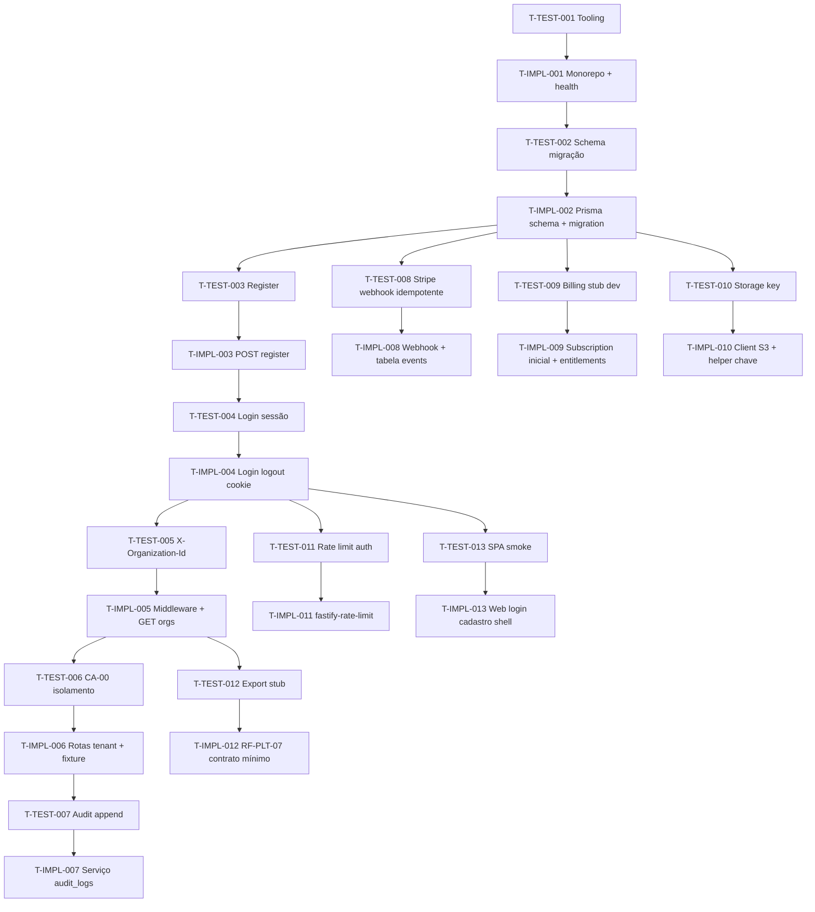

# Tasks — Product v1 / incremento M0 (Plataforma SaaS)

Ordem **TDAD**: para cada fatia, a tarefa de **teste/verificação** vem antes da tarefa de **implementação** correspondente. IDs estáveis para rastreio e possível sync Linear.

**Mapa geral:** RF-PLT-01…07, CA-00, ADR-0001…0006, `plan.md`.

---

## Grafo de dependências (resumo)

---

## Wave 0 — Tooling e monorepo

### T-TEST-001 — Pipeline de testes e DB efêmero

| Campo | Conteúdo |
|-------|-----------|
| **What** | Definir runner (ex.: Vitest), ambiente `DATABASE_URL` para testes, script `pnpm test` que sobe/sobe schema ou usa `prisma migrate deploy` contra container local documentado em README mínimo. |
| **Where** | Raiz do repositório (`package.json`, `vitest.config.*`, `.env.test.example`). |
| **Done-when** | `pnpm test` executa sem testes de negócio ainda **ou** com um smoke `expect(true)` documentado como placeholder até I-002. |
| **Maps to** | Base para CA-00 e todas as T-TEST seguintes. |
| **Depends on** | — |

### T-IMPL-001 — Monorepo, API Fastify, health check

| Campo | Conteúdo |
|-------|-----------|
| **What** | Workspaces `apps/api` (ou `packages/api`), Fastify + TypeScript strict, `GET /health` (sem auth), logging JSON (`pino`), Dockerfile opcional. |
| **Where** | `apps/api/`, `pnpm-workspace.yaml` ou npm workspaces. |
| **Done-when** | `pnpm dev` (api) responde 200 em `/health`; lint/format mínimo opcional. |
| **Maps to** | `plan.md` componente API; ADR-0003. |
| **Depends on** | T-TEST-001 |

---

## Wave 1 — Persistência núcleo M0

### T-TEST-002 — Migração aplica tabelas M0

| Campo | Conteúdo |
|-------|-----------|
| **What** | Teste de integração: após `migrate deploy`, Prisma consegue `findMany` em modelos vazios `User`, `Organization`, `Membership`, `Session`, `Subscription`, `AuditLog`, `StripeEventProcessed` (nomes alinhados ao schema final). |
| **Where** | `apps/api/src/__tests__/migration.test.ts` (ou equivalente). |
| **Done-when** | CI local passa com Postgres de teste. |
| **Maps to** | `plan.md` modelo de dados; ADR-0001. |
| **Depends on** | T-IMPL-001 |

### T-IMPL-002 — Schema Prisma + primeira migration

| Campo | Conteúdo |
|-------|-----------|
| **What** | Modelos: `User` (email unique, passwordHash), `Organization`, `Membership` (role enum owner/member, status), `Session` (token hash, expiresAt, userId), `Subscription` (orgId, stripe ids nullable, status, planCode), `AuditLog`, `StripeEventProcessed` (eventId unique), seed `PlanEntitlement` para `trial`/`free` se aplicável. |
| **Where** | `prisma/schema.prisma`, `prisma/migrations/*`, `prisma/seed.ts`. |
| **Done-when** | T-TEST-002 verde; FKs e índices em `organization_id` onde couber. |
| **Maps to** | RF-PLT-01 (coluna org em todas entidades futuras — já nas tabelas M0); ADR-0001, ADR-0003. |
| **Depends on** | T-TEST-002 |

---

## Wave 2 — Identidade: registro (onboarding)

### T-TEST-003 — POST /v1/auth/register

| Campo | Conteúdo |
|-------|-----------|
| **What** | Teste de integração: corpo válido (email, senha, nome org) → 201; `User`, `Organization`, `Membership(owner)` persistidos; email único duplicado → 409. |
| **Where** | `apps/api/src/__tests__/auth-register.test.ts`. |
| **Done-when** | Asserções em transação ou cleanup entre testes. |
| **Maps to** | RF-PLT-02, RF-PLT-03, RF-PLT-04; ADR-0002. |
| **Depends on** | T-IMPL-002 |

### T-IMPL-003 — Handler de registro + Argon2

| Campo | Conteúdo |
|-------|-----------|
| **What** | `POST /v1/auth/register`, hash Argon2id, criação transacional user+org+membership; validação de input (Zod ou similar). |
| **Where** | `apps/api/src/routes/auth.ts`, `services/registration.ts`. |
| **Done-when** | T-TEST-003 verde. |
| **Maps to** | Idem. |
| **Depends on** | T-TEST-003 |

---

## Wave 3 — Login, sessão, logout

### T-TEST-004 — Cookie de sessão e invalidação

| Campo | Conteúdo |
|-------|-----------|
| **What** | Login correto → `Set-Cookie` com sessão opaca; request autenticada com cookie → 200 em rota `/v1/me`; logout → cookie invalidado e `/v1/me` → 401. |
| **Where** | `apps/api/src/__tests__/auth-session.test.ts`. |
| **Done-when** | Cookies HttpOnly testáveis via agente supertest com `jar`. |
| **Maps to** | RF-PLT-03; ADR-0002. |
| **Depends on** | T-IMPL-003 |

### T-IMPL-004 — Login, logout, middleware de sessão

| Campo | Conteúdo |
|-------|-----------|
| **What** | `POST /v1/auth/login`, `POST /v1/auth/logout`, `GET /v1/me`; tabela `sessions` com token hasheado; rotação opcional documentada. |
| **Where** | `apps/api/src/plugins/session.ts`, rotas auth. |
| **Done-when** | T-TEST-004 verde. |
| **Maps to** | Idem. |
| **Depends on** | T-TEST-004 |

---

## Wave 4 — Contexto de organização (ADR-0006)

### T-TEST-005 — Header X-Organization-Id

| Campo | Conteúdo |
|-------|-----------|
| **What** | Usuário com membership: sem header em rota tenant → 400; header UUID sem membership → 403; header válido → 200 em rota placeholder (ex.: `GET /v1/org-profile`). |
| **Where** | `apps/api/src/__tests__/org-context.test.ts`. |
| **Done-when** | Cobre ADR-0006 explicitamente. |
| **Maps to** | RF-PLT-01, RF-PLT-04; ADR-0006. |
| **Depends on** | T-IMPL-004 |

### T-IMPL-005 — Middleware org + GET /v1/organizations

| Campo | Conteúdo |
|-------|-----------|
| **What** | Plugin Fastify resolve `organizationId` do header, valida membership, injeta em `request`; `GET /v1/organizations` lista orgs do usuário. |
| **Where** | `apps/api/src/plugins/organization-context.ts`, rotas org. |
| **Done-when** | T-TEST-005 verde. |
| **Maps to** | Idem. |
| **Depends on** | T-TEST-005 |

---

## Wave 5 — Isolamento CA-00

### T-TEST-006 — Dois tenants, zero vazamento

| Campo | Conteúdo |
|-------|-----------|
| **What** | Criar org A e org B com users distintos; criar recurso mínimo escopado (ex.: linha `AuditLog` ou recurso `Organization` metadata) em A; user B com `X-Organization-Id: A` → 403; user B com B → só vê dados de B. |
| **Where** | `apps/api/src/__tests__/tenant-isolation.test.ts`. |
| **Done-when** | **CA-00** documentado como verificado neste arquivo de teste. |
| **Maps to** | CA-00, RF-PLT-01. |
| **Depends on** | T-IMPL-005 |

### T-IMPL-006 — Garantir enforcement em rotas tenant

| Campo | Conteúdo |
|-------|-----------|
| **What** | Todas as rotas sob `/v1` que forem de domínio usam apenas repositórios que recebem `organizationId` do contexto; nunca de querystring livre. |
| **Where** | Refino de rotas + helpers `assertOrgContext`. |
| **Done-when** | T-TEST-006 verde. |
| **Maps to** | CA-00. |
| **Depends on** | T-TEST-006 |

---

## Wave 6 — Auditoria

### T-TEST-007 — Eventos append-only

| Campo | Conteúdo |
|-------|-----------|
| **What** | Após register/login/mudança de plano simulada, existe linha em `audit_logs` com `actor_user_id`, `organization_id`, `action` esperado. |
| **Where** | `apps/api/src/__tests__/audit.test.ts`. |
| **Done-when** | Não permite update/delete via API pública nos logs (teste tenta e falha ou não expõe). |
| **Maps to** | RF-PLT-06. |
| **Depends on** | T-IMPL-006 |

### T-IMPL-007 — Serviço AuditLog

| Campo | Conteúdo |
|-------|-----------|
| **What** | `appendAudit({ orgId, actorId, action, resourceType, resourceId?, metadata })` chamado nos fluxos mínimos (register, login, webhook subscription updated). |
| **Where** | `apps/api/src/services/audit.ts`. |
| **Done-when** | T-TEST-007 verde. |
| **Maps to** | RF-PLT-06. |
| **Depends on** | T-TEST-007 |

---

## Wave 7 — Stripe webhooks

### T-TEST-008 — Idempotência de webhook

| Campo | Conteúdo |
|-------|-----------|
| **What** | Payload fake assinado (mock secret) processado duas vezes: segunda vez não altera estado adicionalmente; `stripe_events_processed` contém uma linha. |
| **Where** | `apps/api/src/__tests__/stripe-webhook.test.ts`. |
| **Done-when** | Usar fixture JSON mínima (`customer.subscription.updated`). |
| **Maps to** | ADR-0005; RF-PLT-05 (estado de plano). |
| **Depends on** | T-IMPL-002 |

### T-IMPL-008 — POST /webhooks/stripe

| Campo | Conteúdo |
|-------|-----------|
| **What** | Rota raw body para verificação de assinatura Stripe; handler atualiza `Subscription`; idempotência por `event.id`. |
| **Where** | `apps/api/src/routes/webhooks-stripe.ts`. |
| **Done-when** | T-TEST-008 verde; documentar variáveis `STRIPE_WEBHOOK_SECRET`. |
| **Maps to** | ADR-0005. |
| **Depends on** | T-TEST-008 |

---

## Wave 8 — Assinatura inicial e entitlements

### T-TEST-009 — Plano trial em dev sem Stripe

| Campo | Conteúdo |
|-------|-----------|
| **What** | Com `BILLING_PROVIDER=none`, org criada no register possui `Subscription` com `plan_code=trial` (ou equivalente seed). |
| **Where** | `apps/api/src/__tests__/billing-stub.test.ts`. |
| **Done-when** | Com Stripe mockado opcional: transição de status quando webhook chega. |
| **Maps to** | RF-PLT-05; ADR-0005. |
| **Depends on** | T-IMPL-002 |

### T-IMPL-009 — Entitlements e enforcement mínimo

| Campo | Conteúdo |
|-------|-----------|
| **What** | Leitura de limites por `plan_code` (seed); função `assertWithinEntitlement(org, 'max_workspaces', count)` retornando 403 se exceder — usar constante até M1 criar workspaces reais (pode checar count=0 vs limite). |
| **Where** | `apps/api/src/services/entitlements.ts`. |
| **Done-when** | T-TEST-009 verde. |
| **Maps to** | RF-PLT-05. |
| **Depends on** | T-TEST-009 |

---

## Wave 9 — Object storage (ADR-0004)

### T-TEST-010 — Convenção de chave S3

| Campo | Conteúdo |
|-------|-----------|
| **What** | Teste unitário: `buildObjectKey(orgId, ...)` retorna string com prefixo `orgId` e sanitização de nome. |
| **Where** | `apps/api/src/__tests__/storage-key.test.ts`. |
| **Done-when** | Casos com caracteres especiais no filename. |
| **Maps to** | ADR-0004; prepara RF-ATT / RF-IMP futuros. |
| **Depends on** | T-IMPL-002 |

### T-IMPL-010 — Cliente S3 + presign stub

| Campo | Conteúdo |
|-------|-----------|
| **What** | Config `@aws-sdk/client-s3` (ou MinIO compatível); função presigned PUT opcional; rota interna `GET /v1/storage/ping` que só valida credenciais e bucket (opcional) ou retorna config ok sem upload em CI. |
| **Where** | `apps/api/src/services/storage.ts`. |
| **Done-when** | T-TEST-010 verde; `.env.example` com variáveis S3. |
| **Maps to** | ADR-0004. |
| **Depends on** | T-TEST-010 |

---

## Wave 10 — Rate limit em auth

### T-TEST-011 — /v1/auth/* retorna 429

| Campo | Conteúdo |
|-------|-----------|
| **What** | Simular N+1 tentativas de login falho ou register → última resposta 429 (limiar configurável baixo em teste). |
| **Where** | `apps/api/src/__tests__/rate-limit.test.ts`. |
| **Done-when** | Limiar documentado. |
| **Maps to** | `plan.md` segurança. |
| **Depends on** | T-IMPL-004 |

### T-IMPL-011 — Plugin rate-limit Fastify

| Campo | Conteúdo |
|-------|-----------|
| **What** | `@fastify/rate-limit` (ou equivalente) em prefixo `/v1/auth`. |
| **Where** | `apps/api/src/app.ts` ou plugin dedicado. |
| **Done-when** | T-TEST-011 verde. |
| **Maps to** | Idem. |
| **Depends on** | T-TEST-011 |

---

## Wave 11 — RF-PLT-07 stub (export / delete contrato)

### T-TEST-012 — Contrato de export ou status deferido

| Campo | Conteúdo |
|-------|-----------|
| **What** | `GET /v1/organizations/:id/export` com membership: retorna 501 com JSON `{ "status": "not_implemented", "issue": "RF-PLT-07" }` **ou** 200 com JSON vazio `{}` documentado como contrato provisório — escolha uma e teste fixa o contrato. |
| **Where** | `apps/api/src/__tests__/export-stub.test.ts`. |
| **Done-when** | Comportamento estável e documentado em OpenAPI/README. |
| **Maps to** | RF-PLT-07. |
| **Depends on** | T-IMPL-005 |

### T-IMPL-012 — Rota stub export + doc delete

| Campo | Conteúdo |
|-------|-----------|
| **What** | Implementar a escolha do teste; adicionar nota em README sobre fluxo futuro de exclusão de org (fila + retenção). |
| **Where** | Rotas org. |
| **Done-when** | T-TEST-012 verde. |
| **Maps to** | RF-PLT-07. |
| **Depends on** | T-TEST-012 |

---

## Wave 12 — Web app mínima

### T-TEST-013 — Smoke E2E cadastro + login

| Campo | Conteúdo |
|-------|-----------|
| **What** | Playwright (ou Cypress): fluxo feliz abre SPA, preenche cadastro, confirma redirecionamento para shell autenticado; login com mesmo usuário. |
| **Where** | `apps/web/e2e/onboarding.spec.ts`. |
| **Done-when** | Roda em CI com API + web sob docker-compose ou `webServer` do Playwright. |
| **Maps to** | `plan.md` UI M0; RF-PLT-02/03. |
| **Depends on** | T-IMPL-004 |

### T-IMPL-013 — SPA Vite + React páginas auth + shell

| Campo | Conteúdo |
|-------|-----------|
| **What** | Páginas `/register`, `/login`, dashboard placeholder; chamadas `fetch` para API com `credentials: 'include'`; armazenar `X-Organization-Id` após listar orgs (primeira org no M0). |
| **Where** | `apps/web/`. |
| **Done-when** | T-TEST-013 verde; formulários com labels acessíveis (Implement fará refinamento WCAG). |
| **Maps to** | `plan.md` componente Web App. |
| **Depends on** | T-TEST-013 |

---

## Opcional M0.1 (não bloqueia fechamento M0)

| ID | Título | Nota |
|----|--------|------|
| T-IMPL-O01 | Convite de membro por e-mail | Fora do núcleo M0 se escopo apertar (`plan.md`). |
| T-IMPL-O02 | Verificação de e-mail obrigatória antes de billing real | Fluxo transacional + template. |

---

## Gate Tasks → Implement

**Status:** fechado em 2026-04-15 — implementação alinhada ao grafo (T-TEST / T-IMPL 001–013); Vitest da API verde; dev local documentado em `README.md` (proxy Vite + CORS dev).

**Sugestão de primeira execução:** ondas 0→5 em sequência; 7–8 Stripe pode paralelizar com 9–10 apenas após I-002 estável.
