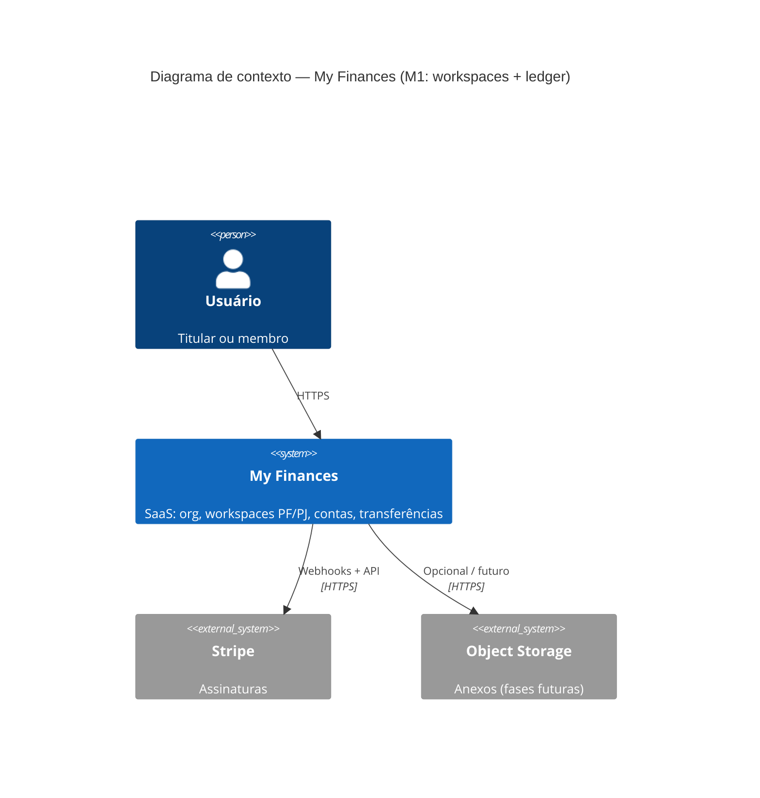
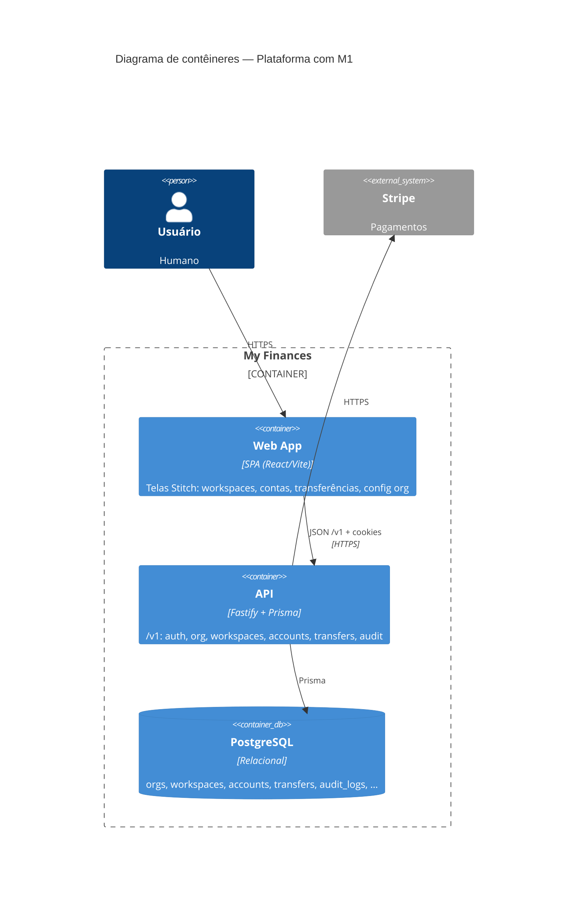

# C4 — Marco M1 (Workspaces e núcleo ledger)

Extensão do diagrama de plataforma após M0. **Níveis:** L1 Contexto (delta) + L2 Contêineres (atualizado).

**Referência Stitch:** `docs/design/README.md` e tabela em `.specs/features/m1-workspaces-core/spec.md` (*Referência de UI*).

---

## L1 — Diagrama de contexto (M1)

M1 **não** introduz sistemas externos novos obrigatórios; o ledger vive na API + PostgreSQL.

---

## L2 — Diagrama de contêineres (M0 → M1)

### Componentes lógicos **dentro** da API (L3 mental, não obrigatório no diagrama)

- **Tenancy** — `requireOrgContext` (ADR-0006) + resolução de `workspaceId` em rotas aninhadas (ADR-0008).
- **Ledger** — serviços: workspace CRUD + entitlement; accounts; transfers com transação e regras PF↔PJ.
- **Audit** — reutiliza `appendAudit` com novas ações (`workspace.*`, `account.*`, `transfer.create`).

---

## Sequência (opcional — visão única)

Fluxo **transferência PF → PJ** (resumo): cliente `POST /v1/transfers` → API valida sessão + org + contas + regras → persiste `Transfer` em transação serializável → resposta 201 → evento audit.

*(Diagrama de sequência detalhado pode ser acrescentado na fase Tasks se útil para testes E2E.)*
