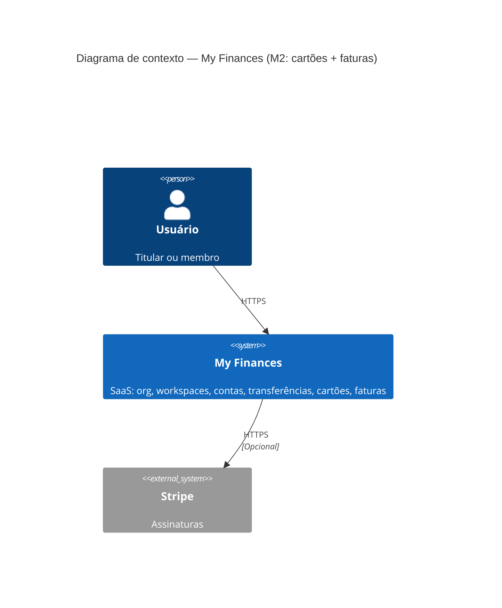
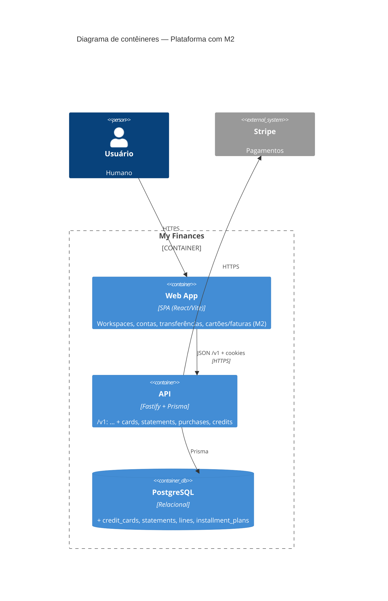

# C4 — Marco M2 (Cartões e faturas)

Extensão da plataforma após M1. **Níveis:** L1 Contexto (delta) + L2 Contêineres (atualizado).

**Spec:** `.specs/features/m2-cards-billing/spec.md`  
**ADRs:** [0009](../adr/0009-credit-card-billing-domain.md), [0010](../adr/0010-api-credit-card-scoping.md)

---

## L1 — Diagrama de contexto (M2)

M2 **não** adiciona sistemas externos obrigatórios; motor de faturas e cartões residem na API + PostgreSQL.

---

## L2 — Diagrama de contêineres (M1 → M2)

### Componentes lógicos **dentro** da API (L3 mental)

- **Tenancy** — ADR-0006 + resolução de workspace no path (ADR-0008).
- **Ledger M1** — workspaces, accounts, transfers (inalterado; opcional ligação futura ao pagar fatura).
- **Card billing (M2)** — ciclo de faturas (`ensureStatementsCurrent`), cartões, compras/parcelas, créditos, antecipação; transações serializáveis + retry onde ADR-0009 exige.
- **Audit** — extensão de `appendAudit` para eventos M2.

---

## Sequência (opcional — compra parcelada)

Fluxo resumido: cliente `POST .../cards/:id/purchases` com `installmentCount = N` → API autentica org + workspace + cartão → `ensureStatementsCurrent` → valida limite → cria `InstallmentPlan` + N linhas `installment` em statements projetados → 201 + corpo com ids.

*(Diagrama de sequência detalhado pode ser acrescentado na fase Tasks.)*
