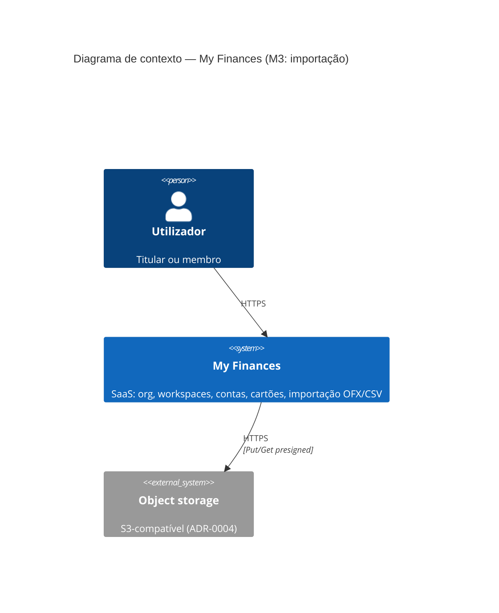
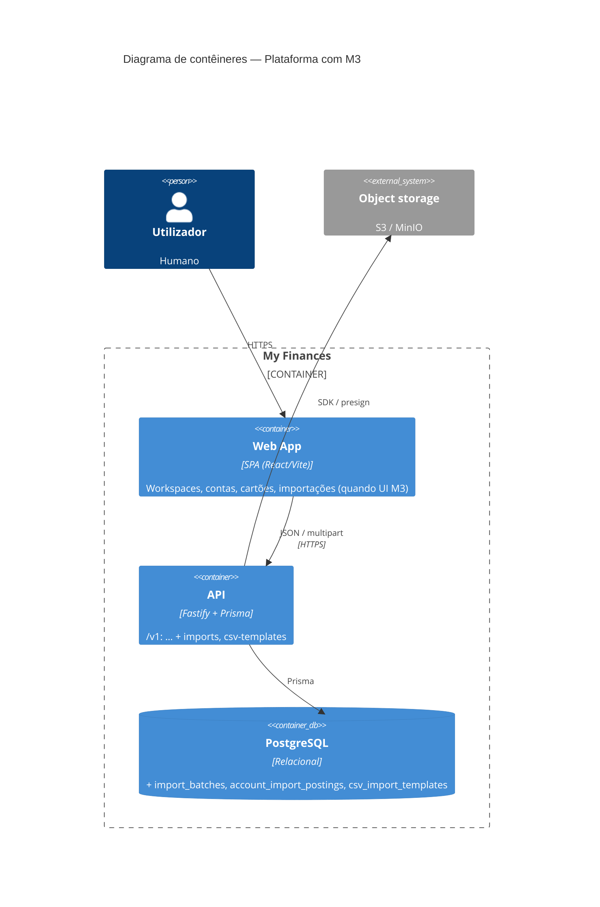

# C4 — Marco M3 (Importação OFX / CSV)

Extensão da plataforma após M2. **Níveis:** L1 Contexto (delta) + L2 Contêineres (atualizado).

**Spec:** `.specs/features/m3-import-ofx-csv/spec.md`  
**ADRs:** [0011](../adr/0011-import-ofx-csv-domain.md), [0012](../adr/0012-api-import-ofx-csv-scoping.md)

---

## L1 — Diagrama de contexto (M3)

M3 **não** adiciona sistema de pagamento novo; liga o **mesmo** storage já usado pela plataforma.

---

## L2 — Diagrama de contêineres (M2 → M3)

### Componentes lógicos **dentro** da API (L3 mental)

- **Tenancy** — ADR-0006 + workspace no path (ADR-0008).
- **Ledger M1** — `Account`, `Transfer`; saldo estendido com postings M3 (ADR-0011).
- **Card billing (M2)** — inalterado; sem obrigação de ligar fatura a import neste marco.
- **Import M3** — upload, parsers OFX/CSV, aplicação de linhas, dedupe, templates.
- **Audit** — eventos de import e template.

---

## Sequência (resumo — upload OFX)

1. Cliente `POST /v1/workspaces/:id/imports` com `file` + `accountId`.
2. API valida membership, workspace, conta; cria `ImportBatch` `pending`.
3. API grava bytes no storage (chave por org/workspace); atualiza `storageKey`.
4. Motor OFX parseia → linhas normalizadas.
5. Serviço apply insere `AccountImportPosting` com dedupe; atualiza batch `completed`/`partial`/`failed`.
6. Resposta JSON com id do batch e resumo.
