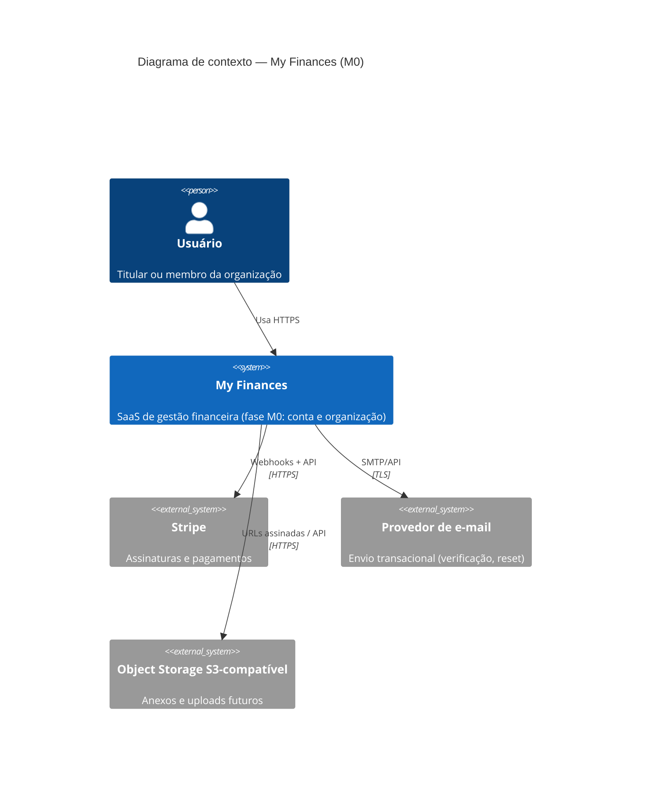
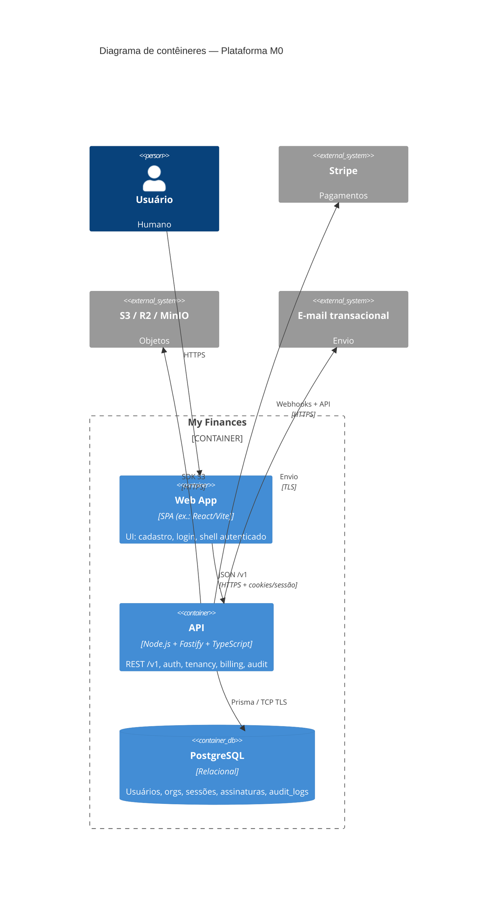

# C4 — Plataforma M0 (My Finances)

Diagramas no formato C4 (Mermaid). **Níveis incluídos:** L1 Contexto + L2 Contêineres (padrão spec-driven). Diagrama de sequência opcional pode ser acrescentado na fase Tasks/Implement para onboarding.

---

## L1 — Diagrama de contexto

Visão em texto: o usuário interage com **My Finances**; o sistema integra **Stripe**, **e-mail** e **armazenamento de objetos** externos.

---

## L2 — Diagrama de contêineres

Checkout direto do usuário ao Stripe (portal self-service) fica para fase posterior; no M0 a cobrança é orientada por webhooks e estado espelhado na API.

### Notas

- **Worker assíncrono** não aparece no M0 mínimo; webhooks Stripe podem ser tratados na própria API com fila interna ou endpoint dedicado com timeout alto. Se a carga exigir, um contêiner **Worker** será adicionado por ADR posterior.
- **Motores de domínio** (importação, parcelas) não são contêineres no M0 — permanecem fora do diagrama até M2/M3.
